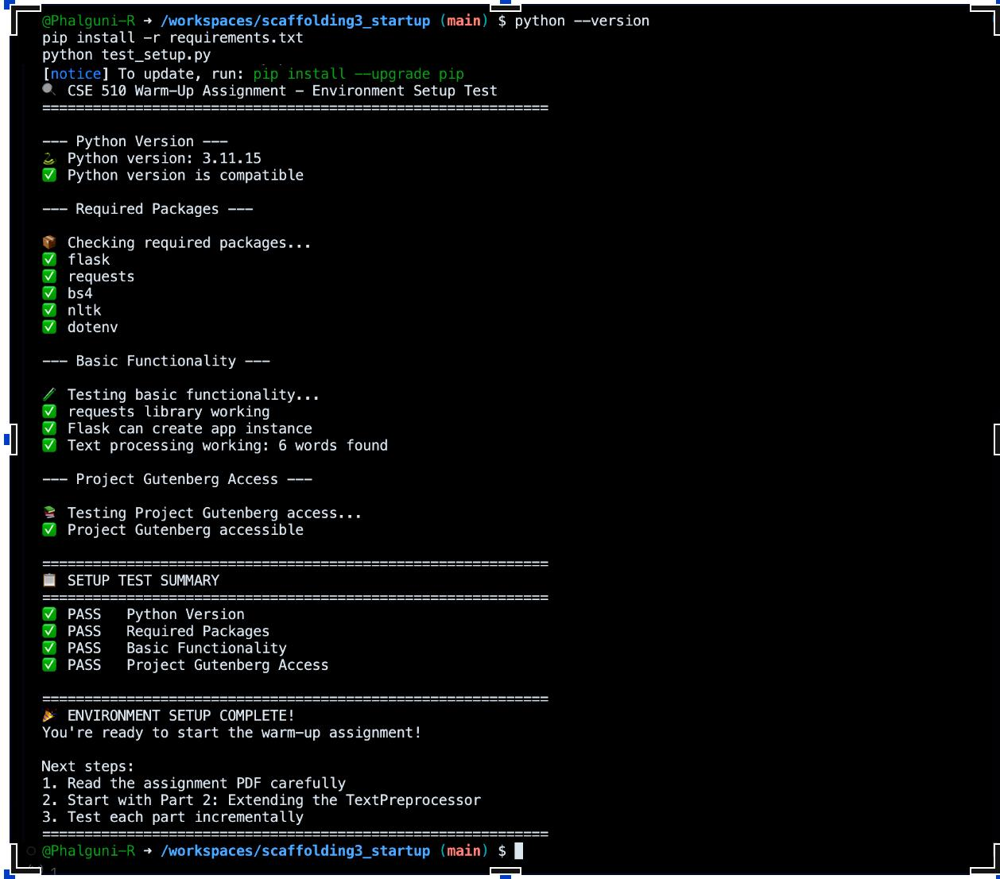
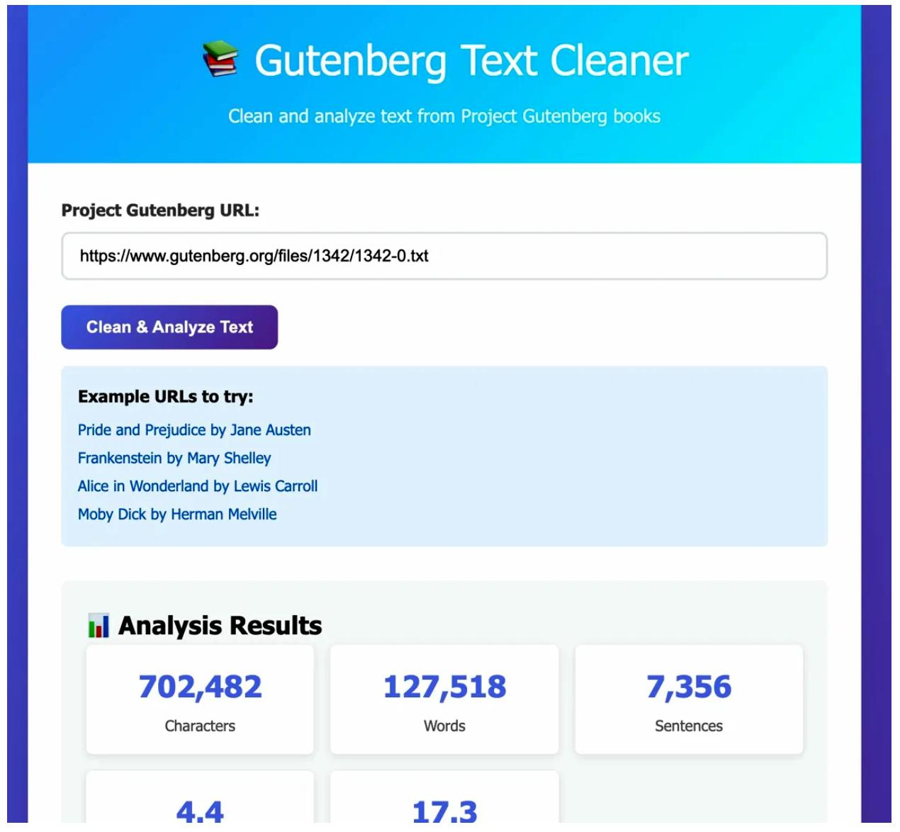
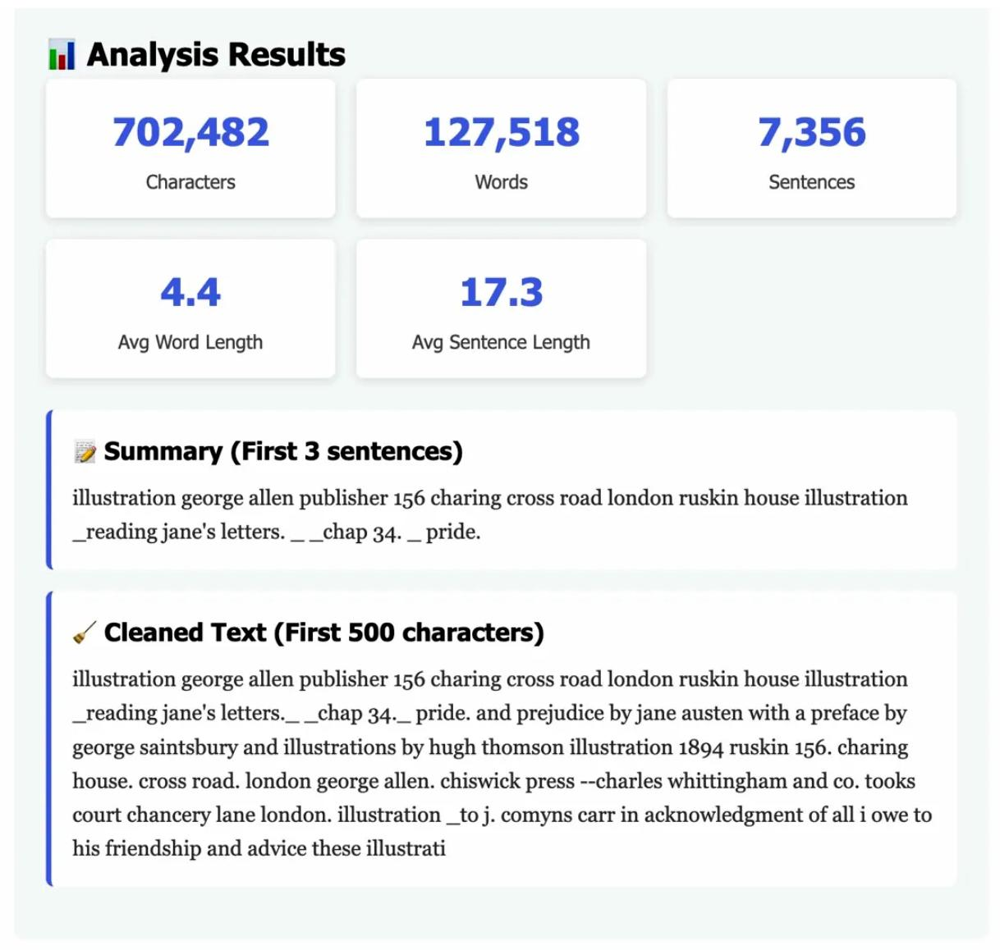

# Gutenberg Text Cleaner — Scaffolding Assignment 3

A Flask-based web service that fetches, cleans, and analyzes plain-text books from Project Gutenberg. Built as part of the Basics of AI (CSE 510) course, Spring 2026.

## What It Does

- Fetches raw text from any Project Gutenberg `.txt` URL
- Strips Gutenberg headers and footers
- Normalizes text (lowercases, removes special characters, standardizes punctuation)
- Calculates statistics: character count, word count, sentence count, average word/sentence length, and top 10 most common words
- Generates a 3-sentence extractive summary
- Serves everything through a clean web interface

## How to Run

1. Fork this repository and create a GitHub Codespace
2. Install dependencies:
pip install -r requirements.txt
3. Verify setup:
python test_setup.py
4. Start the server:
python app.py
5. Open the browser (Codespace will prompt you to open port 5000)

## API Endpoints

| Method | Endpoint       | Description                          |
|--------|---------------|--------------------------------------|
| GET    | `/`           | Web interface                        |
| GET    | `/health`     | Health check                         |
| POST   | `/api/clean`  | Fetch URL, clean text, return stats  |
| POST   | `/api/analyze`| Analyze raw text, return stats       |

### Example API Usage

**POST /api/clean**
```json
{
  "url": "https://www.gutenberg.org/files/1342/1342-0.txt"
}
```

**POST /api/analyze**
```json
{
  "text": "Your raw text here..."
}
```

## Project Structure

- `starter_preprocess.py` — TextPreprocessor class with fetching, cleaning, statistics, and summary methods
- `app.py` — Flask application with API endpoints
- `templates/index.html` — Web interface
- `test_setup.py` — Environment verification script
- `requirements.txt` — Python dependencies

## Screenshots

### Environment Setup


### Working Application — Analysis Results



## Tested With

- Pride and Prejudice by Jane Austen
- Alice in Wonderland by Lewis Carroll
- Frankenstein by Mary Shelley
- Moby Dick by Herman Melville
